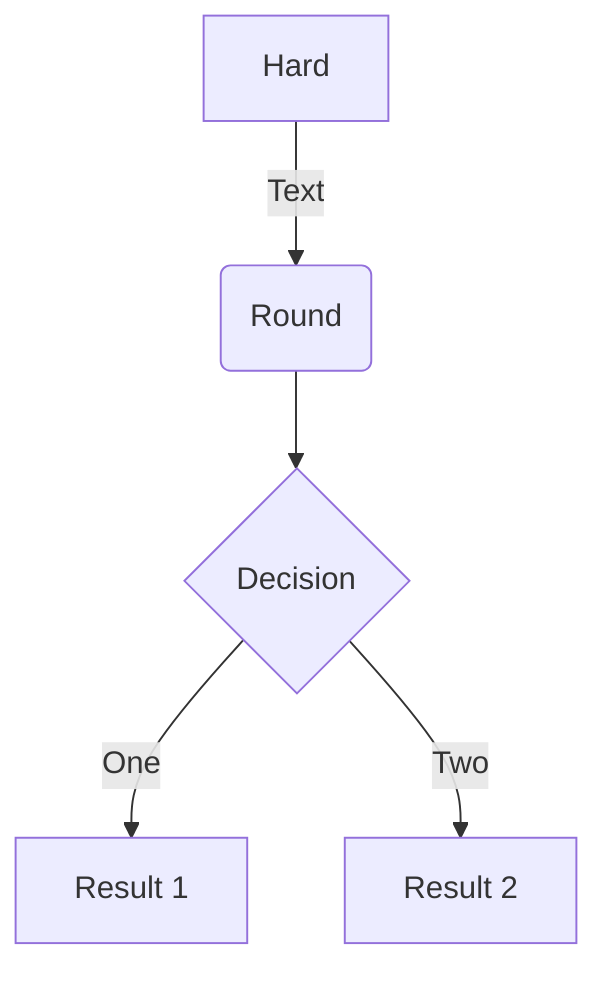

在这里主要记录makedown的使用语法，以备后续写作时的不时之需。

<!--more-->

## Atom

软件下载地址（国内）：https://npm.taobao.org/mirrors/atom/
> https://registry.npmmirror.com/-/binary/atom/v1.60.0/atom-amd64.deb

- 插件
``` shell
apm install tool-bar markdown-writer tool-bar-markdown-writer markdown-scroll-sync
apm install minimap  #右边的代码缩略图
```
侧边栏目录树打开关闭快捷键： `Ctrl + \`


正常使用以上命令进行下载过于缓慢，因此可以切换atom源：
```
apm config set registry https://registry.npm.taobao.org
apm config list       #列出当前配置
apm install --check   #检查是否成功
```

- 关闭启动欢迎页：File -> Setting -> Packages -> 搜索welcome，点击Disable
- 关闭拼写检查：File -> Setting -> Packages -> 搜索spell-check，点击Disable

如果插件无法下载，可以在github相应的仓库中单独下载解压到`$HOME.atom/packages`目录下。
```
~/.atom/packages
↪ =>$ls
markdown-scroll-sync  markdown-writer  minimap  tool-bar  tool-bar-markdown-writer
```

## Markdown语法

* 分段： `两个回车`

* 换行 `两个空格 + 回车`

* 标题 `# ~ ######` 井号的个数表示几级标题，即Markdown可以表示一级标题到六级标题

* 引用 `>`

* 列表 `* ， + ， - ， 1. `选其中之一，注意后面有个空格

* 代码区块 `四个空格` 开头

* 链接 `[文字](链接地址)`

* 图片 `` ，图片地址可以是本地路劲，也可以是网络地址

* 强调 `**文字**` ， `__文字__`

* 删除线：`~~xxxx~~`

* 代码: 三个点

* 待办事宜 `- [ ] 表示未完成`和`- [x] 表示已完成`
> - [ ] 表示未完成
> - [x] 表示已完成

* 段落缩进 `&ensp;&ensp;`（两个空格）

## 流程图

| 操作模块   | 说明    |
| :-------: | :-----: |
| start`    | 开始     |
| end       | 结束     |
| opration  | 普通操作块 |
| condition | 判断块   |
| subroutine| 子任务块 |
| inputoutput | 输入输出块 |

```
''' flow
//定义部分
st=>start: Start:>http://www.google.com[blank]
e=>end:>http://www.google.com
op1=>operation: My Operation
sub1=>subroutine: My Subroutine
cond=>condition: Yes or No?:>http://www.google.com
io=>inputoutput: catch something...

//判断和位置控制
st->op1->cond
cond(yes)->io->e
cond(no)->sub1(right)->op1
'''
```
> st 是变量名， start 是指操作模块名，冒号后面就是内容了。需要注意的是，`冒号后要加空格`才能识别


```flow
//定义部分
st=>start: Start:>http://www.google.com[blank]
e=>end:>http://www.google.com
op1=>operation: My Operation
sub1=>subroutine: My Subroutine
cond=>condition: Yes or No?:>http://www.google.com
io=>inputoutput: catch something...

//判断和位置控制
st->op1->cond
cond(yes)->io->e
cond(no)->sub1(right)->op1
```

## 时序图

```
'''sequence
Alice->Bob: Hello Bob, how are you?
Note right of Bob: Bob thinks
Bob-->Alice: I am good thanks!
'''
```

```sequence
Alice->Bob: Hello Bob, how are you?
Note right of Bob: Bob thinks
Bob-->Alice: I am good thanks!
```


## mermaid

> https://mermaid-js.github.io/mermaid


- [Markdown(四)——绘图工具mermaid之状态图stateDiagram](https://blog.csdn.net/qq_36749906/article/details/107462149)


## Atom和Makedown预览

1.  命令：ctrl + shift + p
2. 输入 markdown preview toggle(可以偷懒只输入**mdpt**，跟Sublime Text一样支持模糊匹配)


## typora

官网：https://typora.io

> Debian/Ubuntu

```
# or use
# sudo apt-key adv --keyserver keyserver.ubuntu.com --recv-keys BA300B7755AFCFAE
wget -qO - https://typora.io/linux/public-key.asc | sudo apt-key add -

# add Typora's repository
sudo add-apt-repository 'deb https://typora.io/linux ./'
sudo apt-get update

# install typora
sudo apt-get install typora
```

> Windows: http://winddoing.github.io/software

### 使用技巧

#### 插入目录

使用“[toc]"会自动根据使用的一二三级标题生成目录

#### 插入分页符

导出pdf时希望分页可以添加这个html实现
```
<div style="page-break-after: always;"></div>
```
